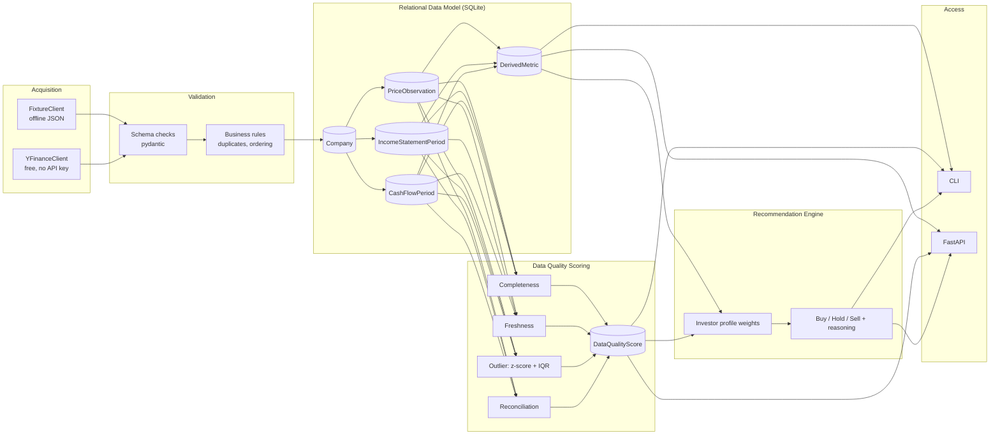

# 📈 Trade Signal Platform

A Buy/Sell stock recommendation engine — built the way a market-data vendor would build it.

Every recommendation this system produces is backed by a **validated, relationally-modeled,
statistically quality-scored dataset**, not a raw API response fed straight into a formula. The
recommendation itself is a thin, transparent, rule-based layer on top of that — the point of this
project is the data management underneath it, not a trading strategy.

The core idea: acquire financial data, validate it, model it relationally, and statistically
score its quality *before* anything downstream (a recommendation, an analysis, a client) ever
touches it. See [What This Demonstrates](#what-this-demonstrates) for how each principle maps to
actual code.

## Why a "trade signal" product, not just a data pipeline?

A raw ETL pipeline is hard to demo and easy to hand-wave. A Buy/Sell call is not — you can run
it, disagree with it, and ask "why?". So the customer-facing product here **is** the
recommendation, exactly like the original concept this project grew out of. What's different is
everything under the hood: the recommendation is only as good as the data behind it, so this
project spends most of its code making that data trustworthy and auditable, and then shows its
work — every verdict ships with the **Data Trust Score** of the dataset it was computed from.

## Architecture



Every write is an **idempotent upsert** keyed on unique constraints (e.g. `company_id + date`),
and every pipeline run is logged stage-by-stage to `PipelineRunLog` for audit/debugging.

## Setup & run (no API key required)

```bash
python -m venv .venv && source .venv/bin/activate
pip install -r requirements.txt
pip install -e .

# Ingest bundled offline fixtures (AAPL, MSFT, and a deliberately messy BADCO)
python -m fdp ingest --ticker AAPL --mode fixture
python -m fdp ingest --ticker MSFT --mode fixture
python -m fdp ingest --ticker BADCO --mode fixture   # watch the quality scores drop

python -m fdp quality-report --ticker BADCO
python -m fdp recommend --ticker AAPL --profile growth_investor
python -m fdp recommend --ticker AAPL --profile value_investor    # same data, different verdict

python -m fdp serve   # http://127.0.0.1:8000/docs

# Optional: real (free, no key) data instead of fixtures
python -m fdp ingest --ticker AAPL --mode live

pytest -q   # 49 tests, fully offline
```

Or run everything at once: `python scripts/seed_demo.py`.

### Sample output

```
$ python -m fdp ingest --ticker BADCO --mode fixture
Rows loaded: {'prices': 85, 'income_statement': 2, 'cash_flow': 3}
Rows rejected by validation: {'prices': 5, 'income_statement': 2, 'cash_flow': 1}

Data Quality:
  prices           composite=0.73  (completeness=0.94 freshness=0.00 outlier=0.85 reconciliation=1.00)
  income_statement composite=0.57  (completeness=0.50 freshness=0.00 outlier=1.00 reconciliation=1.00)
  cash_flow        composite=0.66  (completeness=0.75 freshness=0.00 outlier=0.86 reconciliation=1.00)

Recommendation (Balanced Investor):
  BADCO: SELL, driven mainly by free cash flow growth (supporting the call), valuation (P/E)
  (weighing against the call), price vs. 50-day average (supporting the call).
  Data Trust Score 0.66 (Medium).
```

Compare that to a clean ticker — completeness and outlier scores near 1.0, and a visibly higher
Data Trust Score — and the point of validating and scoring data *before* trusting it becomes
concrete rather than theoretical.

## Customer needs: investor "profiles"

The same modeled data is fit-for-purpose for different customers via `config.INVESTOR_PROFILES`:

| Profile | What it weights | Special behavior |
|---|---|---|
| `balanced` | The original evenly-weighted rule set | — |
| `growth_investor` | EPS / revenue / FCF growth heavily | — |
| `value_investor` | Valuation (P/E) heavily, growth lightly | Lower Buy/Hold thresholds |
| `quality_investor` | Balanced weights | **Vetoes a BUY** if the Data Trust Score is below 0.6 — the recommendation engine will not let a good-looking score override untrustworthy underlying data |

`python -m fdp recommend --ticker AAPL --profile value_investor` vs `--profile growth_investor`
can and do disagree on the same underlying data — that's the point.

## What This Demonstrates

| Data management principle | Where it's implemented |
|---|---|
| Acquire, validate, store, and model financial data | `fdp/acquisition/`, `fdp/validation/`, `fdp/modeling/orm_models.py` |
| Use statistical methods to measure data quality, generate insights | `fdp/quality/checks.py` (completeness, freshness decay, z-score + IQR outlier detection, cross-source reconciliation) |
| Develop interconnected data models that enable analysis across datasets | `DerivedMetric` in `fdp/modeling/orm_models.py` — joins price and fundamentals data per company |
| Understand customer needs so datasets are fit-for-purpose | `fdp/config.py` `INVESTOR_PROFILES`, applied in `fdp/recommend/engine.py` |
| Analyze internal processes to find opportunities for improvement | `PipelineRunLog` audit trail in `fdp/modeling/orm_models.py`, structured JSON logging in `fdp/pipeline/logging_config.py` |
| Data accessible to clients across platforms | `fdp/access/cli.py`, `fdp/access/api.py` |
| High-volume, low-latency ETL pipelines | `fdp/pipeline/etl.py` — idempotent upserts, retry-with-backoff, per-stage logging |
| Programming, data modeling, statistical methods | Throughout; see `tests/` for correctness evidence |

## Testing

`pytest -q` runs 49 tests fully offline (no network, no API key): schema validation rejections,
business-rule flags, data-quality math (including an injected outlier), pipeline idempotency
(running twice never duplicates rows), profile-weighted recommendation logic, and FastAPI
endpoint smoke tests.

## Known limitations & Future Work

This is a portfolio project, not a production system. Deliberately scoped out, to keep the
implemented parts real and correct rather than padding with unfinished ideas:

- **Sentiment analysis (FinBERT) / news & social data** — would add a second, independent signal
  source alongside fundamentals and price data.
- **Natural-language interaction (LLM)** — answering "Should I buy AAPL?" conversationally by
  having an LLM narrate the *existing* structured recommendation (not replace it).
- **ML-based data-quality scoring** (e.g. an Isolation Forest instead of z-score/IQR) — the
  current statistical approach is real and correct, but a learned anomaly model would generalize
  better across very different tickers/sectors.
- **Streaming/parallel ingestion** for genuinely high-volume, low-latency ETL (currently
  sequential and batch-oriented, appropriate for the demo's scale).
- **Additional reconciliation sources** — the reconciliation score is fully implemented but only
  exercised when two sources overlap; the demo mostly runs a single source at a time.

## Project layout

```
├── fdp/
│   ├── acquisition/   # pluggable data sources (fixture + yfinance)
│   ├── validation/     # pydantic schema checks + business rules
│   ├── modeling/       # SQLAlchemy ORM + repository (idempotent upserts)
│   ├── quality/        # statistical data-quality scoring
│   ├── pipeline/       # ETL orchestration, logging, retry
│   ├── recommend/      # growth math, factor normalization, scoring engine
│   └── access/         # CLI + FastAPI
├── data/fixtures/      # offline demo/test data (AAPL, MSFT, BADCO)
├── scripts/            # fixture generator, one-shot demo seeder
└── tests/              # pytest suite, fully offline
```
